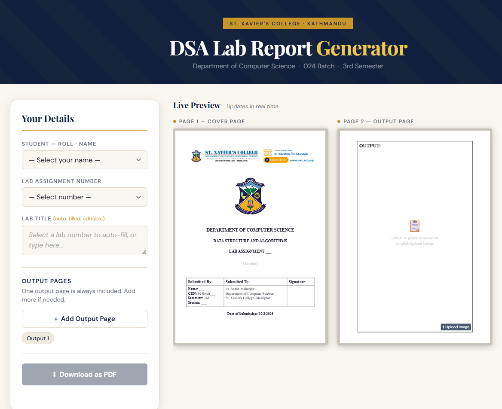

## DSA Lab Report Generator

> A zero-dependency, client-side web app for BScIT students at **St. Xavier's College, Kathmandu** to generate properly formatted Data Structure & Algorithms lab report cover pages and output pages — downloadable as a PDF in one click.

---

## Preview



---

## Features

- **Student dropdown** — pre-loaded with all 44 students (Section A & B, 024 Batch)
- **Auto-fill lab titles** — selecting a lab number instantly fills the title for Labs 1–9
- **Live A4 preview** — cover page updates in real time as you fill the form
- **Output pages** — add as many output pages as needed; paste screenshots with `Ctrl+V` or upload images
- **Drag & resize images** — reposition and scale images freely on the output page using mouse drag and corner handles
- **One-click PDF** — generates a properly formatted A4 PDF using jsPDF, with exact measurements derived from the original Word template

---

## Project Structure

```
dsa-lab-generator/
├── index.html              # App shell — semantic HTML only, no inline styles/scripts
├── css/
│   └── style.css           # All UI styles: layout, form, A4 preview, output pages
├── js/
│   ├── data.js             # All static data: students, lab titles, base64 images
│   ├── preview.js          # Live cover page preview logic
│   ├── output.js           # Output page builder: add/remove pages, paste/upload/drag/resize images
│   └── generate.js         # PDF generation via jsPDF
└── assets/
    ├── banner.png          # SXC header banner (also embedded as base64 in data.js)
    ├── logo.jpg            # SXC college crest (also embedded as base64 in data.js)
    └── DSA_LAB_Generator_TEMPLATE_FIXED.docx   # Original Word template for reference
```

---

## How It Works
```
┌─────────────┐     ┌──────────────┐     ┌──────────────┐     ┌─────────────┐
│   data.js   │ --> |  preview.js  │ --> │  output.js   │ --> │ generate.js │
│             │     │              │     │              │     │             │
│ Students    │     │ Live cover   │     │ Add/remove   │     │ jsPDF →     │
│ Lab titles  │     │ page preview │     │ output pages │     │ A4 PDF      │
│ Base64 imgs │     │ Form binding │     │ Paste/upload │     │             │
│ Static data │     │ Scale to fit │     │ Drag & resize│     │             │
└─────────────┘     └──────────────┘     └──────────────┘     └─────────────┘
```

### 📦 `data.js` — The Data Layer
Loaded first. Exposes four globals every other script depends on:
- `STUDENTS` — all 44 students as `{ roll, name, section }`
- `DSA_LABS` — lab numbers mapped to titles (Labs 10–13 are blank for manual entry)
- `STATIC_FIELDS` — teacher, department, college, semester (never change)
- `BANNER_B64` / `LOGO_B64` — SXC banner and crest as base64, so the app works **fully offline** with no external image requests
- `getToday()` — returns today as `D/M/YYYY`

---

### 👁️ `preview.js` — Live Cover Page Preview
- Populates the student dropdown and sets the date on load
- Listens to all three form controls (`studentSelect`, `labNoSelect`, `labTitleInput`) and calls `updateCoverPreview()` on every change
- `updateCoverPreview()` reads the current form values, updates the relevant DOM elements inside `.a4-inner`, and enables or disables the download button based on whether all fields are filled
- The A4 preview is a real **794×1123px** div (A4 at 96 DPI), scaled down with CSS `transform: scale()` — `scaleAllPages()` computes the scale factor by dividing the container's rendered width by 794, and re-runs on every window resize

---

### 🖼️ `output.js` — Output Page Builder
- `createOutputPage()` builds a full output page DOM structure and appends it to `#outputPagesContainer`. Each page gets its own paste listener, upload button, and hidden file input
- Images can be added via **Ctrl+V** (clipboard paste) or **file upload**. Once added, they are absolutely positioned inside the output box
- `makeImageInteractive()` handles **drag** and **corner-handle resize**, correcting for the CSS scale transform so mouse deltas map accurately to the 794px coordinate space
- `getOutputPages()` is the public API consumed by `generate.js` — returns all page state as `{ id, images: [{ src, x, y, w, h }] }`, where coordinates are in the 794px preview space

---

### 📄 `generate.js` — PDF Generation
Uses [jsPDF](https://github.com/parallax/jsPDF). All measurements are derived **directly from the original Word template XML** — converted from EMU and twips to millimetres:

| Element | Value |
|---|---|
| Page margins | 25.4mm (1 inch) all sides |
| Logo size | 45.473 × 51.206mm |
| Logo position | 37.324mm from page top (margin + posOffset) |
| Table width | 179.299mm (10165 DXA), centered |
| Column widths | 69.762mm / 71.438mm / 38.100mm |
| Header row height | 10.936mm (620 DXA) |
| Data row height | 29.633mm (240 + 4×360 twips) |
| Paragraph spacing | 240 / 360 / 240 twips (before / line / after) |

**Cover page flow:**
1. Banner drawn at top margin, full content width
2. Logo centered, positioned by EMU offset
3. Text block (DEPT → SUBJECT → LAB NO → TITLE) flows below the logo, each paragraph advancing by its twip-calculated height
4. Submission table drawn with `doc.rect()` and precise column positions
5. Date line rendered as bold label + normal value, centered

**Output pages:**
Each output page mirrors the preview exactly. Image coordinates from `getOutputPages()` (in 794px space) are converted to mm using `1px = 25.4/96 mm`, then offset-corrected for the OUTPUT: label area before being embedded with `doc.addImage()`.

Saved as: `DSA_Lab{N}_{roll}_{name}.pdf`
---

## Getting Started

No build step, no install, no server required.

```bash
git clone https://github.com/your-username/dsa-lab-generator.git
cd dsa-lab-generator
```

Then simply open `index.html` in your browser. That's it.

> **Note:** Because the images are embedded as base64 in `data.js`, the app works completely offline after the initial page load.

---

## Usage

1. **Select your name** from the student dropdown
2. **Select the lab number** — the title auto-fills for labs 1–9
3. **Edit the title** if needed (or type one for labs 10–13)
4. On the output page, either **paste a screenshot** (`Ctrl+V`) or click **Upload Image**
5. **Drag and resize** the image to position it on the page
6. Click **Add Output Page** if you have more outputs to include
7. Click **Download as PDF**

---

## Tech Stack

| Tool | Purpose |
|---|---|
| Vanilla HTML/CSS/JS | Everything — no frameworks |
| [jsPDF 2.5.1](https://cdnjs.cloudflare.com/ajax/libs/jspdf/2.5.1/jspdf.umd.min.js) | PDF generation (CDN) |
| [Google Fonts](https://fonts.google.com) | Playfair Display + DM Sans for the UI |
| Times New Roman | Used inside the A4 preview and PDF to match the Word template |

---

## Lab Titles Reference

| Lab | Title |
|---|---|
| 1 | Dynamic Memory Allocation in C |
| 2 | Stack Operations Using Array in C |
| 3 | Infix to Postfix Conversion Using Stack |
| 4 | Linear Queue and Circular Queue Operations in C |
| 5 | Operations on Singly Linked List |
| 6 | Operations on Doubly Linked List (DLL) and Doubly Circular Linked List (DCLL) |
| 7 | Implementation of Recursion |
| 8 | Implementation of Comparison Sorting Algorithms |
| 9 | Implementation of Divide and Conquer Sorting Algorithms |
| 10–13 | *(manual entry)* |

---

## Credits

Built for **024 Batch, 3rd Semester** — Department of Computer Science, St. Xavier's College, Maitighar, Kathmandu.

## Special Thanks

[**Surakshya Dahal**](https://github.com/surakshya0-0) — for providing the student list and the original cover page format that this generator is based on.
